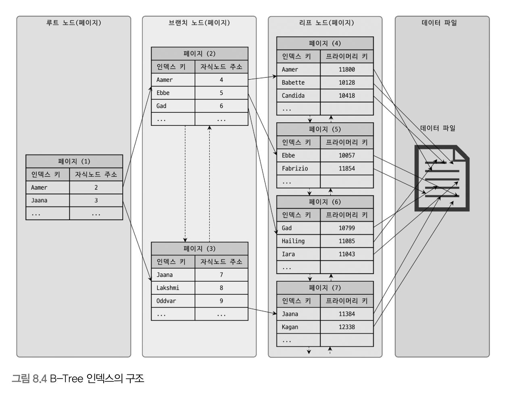

# 인덱스

### 디스크 읽기 방식

디스크에 데이터를 읽고 쓰는데 걸리는 시간은 디스크 헤더를 움직여서 읽고 쓸 위치로 옮기는 단계에서 결정됩니다.  
즉, 디스크의 성능은 디스크 헤더의 위치 이동 없이 얼마나 많은 데이터를 한 번에 기록하느냐에 의해 결정하게 됩니다.

---

### I/O

> I/O 란?  
> 하드 디스크 드라이브의 플래터(원판)를 돌려서 읽어야 할 데이터가 저장된 위치로 디스크 헤더를 이동시킨 다음 데이터를 읽는 것을 의미합니다.

- 랜덤 I/O
  - 여러 위치를 탐색해서 최종적으로 데이터를 찾는 것을 말합니다.
- 순차 I/O
  - 시작위치에 간 뒤 쭉 읽어서 데이터를 찾는 것을 말합니다.

결론으로 두 I/O의 차이점은 디스크에 기록해야 할 위치를 찾기 위해 디스크의 헤드를 움직이는 횟수입니다.  
순차 I/O는 랜덤 I/O 보다 헤드를 움직이는 횟수가 적기 때문에 성능이 더 좋습니다.  
쿼리를 튜닝한다는 것은 랜덤 I/O 자체를 줄여주는 것이 목표이며, 랜덤 I/O를 줄인다는 것은 쿼리를 처리하는 데 꼭 필요한 데이터만 읽도록 쿼리를 개선하는 것을 의미합니다.

---

### 하드 디스크와 솔리드 스테이트 드라이브

- 하드 디스크
  - 물리적인 기계식 장치입니다. 때문에 병목 현상을 피할 수 없습니다.
- 솔리드 스테이트 드라이브
  - 하드 디스크를 대체하기 위한 전자식 저장 매체입니다.
  - 플래시 메모리를 장착하고 있습니다. 이는 하드 디스크처럼 기계적인 부분을 대체하기 때문에 보다 빠른 읽기와 쓰기를 제공합니다. 순차 I/O 작업에서는 조금 빠르거나 비슷한 성능이지만 랜덤 I/O 에서 훨씬 빠른 성능을 보여줍니다.
  - 대신 하드 디스크보다 용량 대비 가격이 비싼 편입니다.

---

### 인덱스란?

- 데이터를 검색할 때 원하는 레코드의 빠르게 접근하기 위해서 레코드 주소를 키,벨류 형태의 쌍으로 저장해놓은 것을 말합니다.
- DBMS 인덱스의 특징
  - SortedList 자료구조를 사용
    - 저장되는 칼럼의 값을 이용해 항상 정렬된 상태를 유지합니다.
    - 데이터가 저장될 떄마다 항상 값을 정리해야 하므로 저장과정이 복잡하고 느리지만, 데이터를 찾을 땐 아주 빠르게 찾을 수 있습니다.
- 결론적으로 인덱스는 데이터의 저장 성능을 희생해서 데이터의 읽기 속도를 높이는 기능입니다.
- 인덱스의 구성
  - 프라이머리 키(Primary Key) - 레코드를 대표하는 칼럼 값으로 만들어진 인덱스를 의미합니다. 식별자라고도 합니다.
  - 프라이머리 키를 제외한 모든 인덱스는 세컨더리 인덱스로 분류합니다.

---

### B-Tree 인덱스

- 구조

  - 트리 구조 최상위에 **루트 노드**가 존재하고, 자식 노드가 붙어 있는 형태입니다. 가장 하위에 있는 노드를 **리프 노드**, 중간의 노드를 **브랜치 노드** 라고 합니다.
  - 데이터베이스에서 인덱스와 실제 데이터가 저장된 데이터는 따로 관리됩니다. 그리고 인덱스의 리프노드는 항상 실제 데이터 레코드를 찾아가기 위한 주솟값을 가지고 있습니다.
    - innoDB 스토리지 엔진에서는 모든 세컨더리 인덱스 검색에서 데이터 레코드를 읽기 위해서는 반드시 프라이머리 키를 저장하고 있는 B-Tree를 다시 한번 검색해야 합니다.

- 인덱스 키 추가

  - 새로운 키 값이 B-Tree에 저장될 때는 저장될 키 값을 이용해 B-Tree상의 적절한 위치를 검색해야 합니다.
  - 적절한 위치가 결정되면 레코드의 키 값과 대상의 레코드의 주소 정보를 B-Tree 리프노드에 저장합니다.
  - 만약 리프 노드가 꽉 차서 더는 저장할 수 없을 때는 리프노드가 분리되어야하며, 이는 상위 브랜치 노드까지 처리의 범위가 넓어집니다.
  - 이러한 작업 탓에 B-Tree는 상대적으로 쓰기 작업에 비용이 많이 듭니다.

- 인덱스 키 삭제

  - B-Tree의 키 값이 삭제되는 경우 해당 키 값이 저장된 B-Tree의 리프 노드를 찾아 삭제 마킹을 합니다.
  - 삭제 마킹된 인덱스 키 공간은 계속 그대로 방치하거나 재활용됩니다.

- 인덱스 키 변경

  - 인덱스 키 값을 변경하는 작업은 기존 인덱스 키 값을 삭제한 후 새로운 인덱스 키 값을 추가하는 작업으로 처리됩니다.

- 인덱스 키 검색
  - 인덱스를 검색하는 작업은 B-Tree의 루트 노드부터 시작해 브랜치 노드를 거쳐 최종 리프 노드까지 이동하면서 비교 작업을 수행합니다. 이를 트리 탐색이라 합니다.
  - 인덱스 트리 탐색은 SELECT 뿐만 아니라 UPDATE나 DELETE를 처리하기 위해 항상 레코드를 먼저 검색해야 할 경우에도 사용됩니다.
  - B-Tree 인덱스를 이용한 검색은 100% 일치 또는 값의 앞부분만 일치하는 경우에 사용할 수 있습니다.

---
