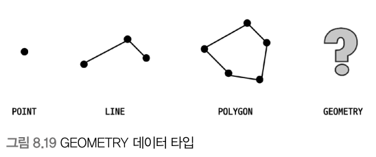

## **8.3.6 B-Tree 인덱스의 정렬 및 스캔 방향**

- 인덱스를 생성할 때 설정한 정렬 규칙에 따라서 인덱스의 키 값은 항상 오름차순이거나 내림차순으로 정렬되어 저장된다.
- 어떤 인덱스가 오름차순으로 생성되었다고 그 인덱스를 오름차순으로만 읽을 수 있다는 뜻이 아니다.
- 인덱스를 어떤 방향으로 읽을지는 쿼리에 따라 옵티마이저가 실시간으로 만들어 내는 실행 계획에 따라 결정된다.

### **8.3.6.1 인덱스의 정렬**

- MySQL 5.7 버전까지는 칼럼 단위로 정렬 순서를 혼합해서 사용할 수 없었다.
- MySQL 8.0 버전부터는 다음과 같은 형태의 정렬 순서를 혼합한 인덱스도 생성할 수 있게 됐다.

```sql
CREATE INDEX ix_teamname_userscore On employees (team_name ASC, user_score DESC)
```

> **주의!**  
> MySQL 5.7에서도 위와 같이 오름차순 칼럼과 내림차순 칼럼을 혼합한 인덱스를 생성할 수 있었다. 하지만 실제 인덱스는 모두 오름차순 정렬만으로 인덱스가 생성됐을 뿐이다. MySQL 5.7 버전까지는 ASC 또는 DESC 키워드는 앞으로 만들어질 버전에 대한 호환성을 위해 문법상으로만 제공된 것이다.

### **8.3.6.1.1 인덱스 스캔 방향**

- 인덱스는 항상 오름차순으로만 정렬돼 있지만 옵티마이저는 인덱스를 최솟값부터 읽으면 오름차순으로 값을 가져올 수 있고, 최댓값부터 거꾸로 읽으면 내림차순으로 값을 가져올 수 있다는 것을 알고 있다.
- 
- 즉 인덱스 생성 시점에 오름차순 또는 내림차순으로 정렬이 결정되지만 쿼리가 그 인덱스를 사용하는 시점에 인덱스를 읽는 방향에 따라 오름차순 또는 내림차순 정렬 효과를 얻을 수 있다.

### **8.3.6.1.2 내림차순 인덱스**

- 만약 first_name 칼럼을 역순으로 정렬하는 요건만 있다면 다음 2개 인덱스 중에서 어떤 것을 선택하는 것이 좋을까?

```sql
CREATE INDEX ix_firstname_asc ON employees (first_name ASC);
CREATE INDEX ix_firstname_dasc ON employees (first_name DESC);
```

- 

  - 오름차순 인덱스(Ascending index): 작은 값의 인덱스 키가 B-Tree의 왼쪽으로 정렬된 인덱스
  - 내림차순 인덱스(Descending index): 큰 값의 인덱스 키가 B-Tree의 왼쪽으로 정렬된 인덱스
  - 인덱스 정순 스캔(Forward index scan): 인덱스 키의 크고 작음에 관계없이 인덱스 리프 노드의 왼쪽 페이지부터 오른쪽으로 스캔
  - 인덱스 역순 스캔(Backward index scan): 인덱스 키의 크고 작음에 관계없이 인덱스 리프 노드의 오른쪽 페이지부터 왼쪽으로 스캔

- 하나의 인덱스를 역순으로 읽는 것은 정순으로 읽을 때보다 28.9% 정도 시간이 더 걸린다.
  - MySQL 서버의 innoDB 스토리지 엔진에서 정순 스캔과 역순 스캔은 페이지(블록) 간의 양방향 연결 고리(Double linked list)를 통해 전진하느냐 후진하느냐의 차이만 있지만, 실제 내부적으로는 InnoDB에서 인덱스 역순 스캔이 정순 스캔에 비해 느릴 수 밖에 없는 이유는 다음과 같다.
    - 페이지 감금이 인덱스 정순 스캔(Forward index scan)에 적합한 구조
    - 페이지 내에서 인덱스 레코드가 단방향으로만 연결된 구조(그림 8.16에서 보다시피 InnoDB 페이지 내부에서 레코드들이 단방향으로만 링크를 가진 구조다.)
    - 

> **참고!**  
> 그림 8.16에서는 InnoDB 페이지 내부에서 레코드들이 정렬 순서대로 저장돼 있는 것처럼 표시돼 있지만 실제로 InnoDB 페이지는 힙(Heap)처럼 사용되기 때문에 물리적으로 저장이 순서대로 배치되지는 않는다.

- 내림차순과 오름차순 인덱스의 내부적인 차이로 인한 성능 차이가 발생한다. 따라서 서비스 요건에 맞게 어떤 정렬 순서의 인덱스를 선택해야 한다.

## **8.3.7 B-Tree 인덱스의 가용성과 효율성**

어떤 경우에 인덱스를 사용할 수 있고 어떤 방식으로 사용할 수 있는지 식별할 수 있어야 한다. 그래야만 쿼리의 조건을 최적화하거나, 역으로 쿼리에 맞게 인덱스를 최적으로 생성할 수 있다.

### **8.3.7.1 비교 조건의 종류와 효율성**

다중 칼럼 인덱스에서 각 칼럼의 순서와 그 칼럼에 사용된 조건이 동등 비교인지 아니면 크다 또는 작다 같은 범위조건인지에 따라 각 인덱스 칼럼의 활용 형태가 달라지며, 그 효율 또한 달라진다.

```sql
SELECT * FROM dept_emp
WHERE dept_no='d002' AND emp_no >= 10114;
```

이 쿼리를 위해 dept_emp 테이블에 각각의 인덱스를 생성했다고 가정하자.

- 케이스 A: INDEX (dept_no, emp_no)
- 케이스 B: INDEX (emp_no, dept_no)

**케이스 A 인덱스**는 "dept_no='d002' AND emp_no>=10144"인 레코드를 찾고, 그 이후에는 dept_no가 'd002'가 아닐 때까지 인덱스를 그냥 쭉 읽기만 하면 된다.  
**케이스 B 인덱스**는 우선 "emp_no>=10144 AND dept_no='d002'"인 레코드를 찾고, 그 이후 모든 레코드에 대해 dept_no가 'd002'인지 비교하는 과정을 거쳐야 한다.


이런 현상이 발생한 이유는 다중 칼럼 인덱스의 정렬 방식이 인덱스 N번째 키 값은 N-1 번째 키 값에 대해서 다시 정렬되기 때문이다.

> 공식적인 명칭은 아니지만 케이스 A 인덱스에서의 두 조건(dept_no='d002' 와 emp_no >= 1044)과 같이 작업의 범위를 결정하는 조건을 **작업 범위 결정 조건**이라 하고, 케이스 B 인덱스의 dept_no='d002' 조건과 같이 비교 작업의 범위를 줄이지 못하고 단순히 거름종이 역할만 하는 조건을 **필터링 조건** 또는 **체크 조건**이라고 표현한다.
>
> 작업 범위를 결정하는 조건은 많으면 많을수록 쿼리의 처리 성능을 높이지만 체크 조건은 많다고 해서 쿼리의 성능을 높이지는 못한다. 오히려 쿼리 실행을 더 느리게 만들 때가 많다.

### **8.3.7.2 인덱스의 가용성**

B-Tree 인덱스의 특징은 왼쪽 값에 기준해서 오른쪽 값이 정렬돼 있다는 것이다. 여기서 왼쪽이란 하나의 칼럼 내에서뿐만 아니라 다중 칼럼 인덱스의 칼럼에 대해서도 함께 적용된다.

- 케이스 A: INDEX(first_name)
- 케이스 B: INDEX(dept_no, emp_no)


### **8.3.7.3 가용성과 효율성 판단**

B-Tree 인덱스를 사용할 수 없는 조건 (사용할 수 없다는 것은 작업 범위 결정 조건으로 사용할 수 없다는 것을 의미하며, 경우에 따라서는 체크 조건으로 인덱스를 사용할 수는 있다.)

- NOT-EQUAL로 비교된 경우("<>", "NOT IN", "NOT BETWEEN", "IS NOT NULL")
  - .. WHERE column <> 'N'
  - .. WHERE column NOT IN (10, 11, 12)
  - .. WHERE column IS NOT NULL
- LIKE '%??'(앞부분이 아닌 뒷부분 일치) 형태로 문자열 패턴이 비교된 경우
  - .. WHERE column LIKE '%승환'
  - .. WHERE column LIKE '\_승환'
  - .. WHERE column LIKE '%승%'
- 스토어드 함수나 다른 연산자로 인덱스 칼럼이 변형된 후 비교된 경우
  - .. WHERE SUBSTRING(column, 1, 1) = 'X'
  - .. WHERE DAYOFMONTH(column) = 1
- NOT-DETERMINISTIC 속성의 스토어드 함수가 비교 조건에 사용된 경우
  - .. WHERE column = deterministic_function()
- 데이터 타입이 서로 다른 비교(인덱스 칼럼의 타입을 변환해야 비교가 가능한 경우)
  - .. WHERE char_column = 10
- 문자열 데이터 타입의 콜레이션이 다른 경우
  - .. WHERE utf8_bin_char_column = euckr_bin_char_column

> 다른 일반적인 DBMS에서는 NULL 값이 인덱스에 저장되지 않지만 MySQL 에서는 NULL 값도 인덱스에 저장된다. 다음과 같은 WHERE 조건도 작업 범위 결정 조건으로 인덱스를 사용한다.
>
> ```sql
> .. WHERE column IS NULL ..
> ```

다중 칼럼으로 만들어진 인덱스는 어떤 조건으로 사용될 수 있고, 어떤 경우에 절대 사용할 수 없는가

```sql
INDEX ix_test ( column_1, column_2, column_3, .., column_n )
```

위와 같은 인덱스가 있다면

- 작업 범위 결정 조건으로 인덱스를 사용하지 못하는 경우
  - column_1 칼럼에 대한 조건이 없는 경우
  - column_1 칼럼의 비교 조건이 위의 인덱스 사용 불가 조건 중 하나인 경우
- 작업 범위 결정 조건으로 인덱스를 사용하는 경우(i는 2보다 크고 n보다 작은 임의의 값을 의미)
  - column*1 ~ column*(i - 1) 칼럼까지 동등 비교 형태("=" 또는 "IN")로 비교
  - column_i 칼럼에 대해 다음 연사자 중 하나로 비교
    - 동등 비교("=" 또는 "IN")
    - 크다 작다 형태("<" 또는 ">")
    - LIKE로 좌측 일치 패턴(LIKE '승환%')

위의 두 가지 조건을 모두 만족하는 쿼리는 column*1 부터 column_i 까지는 **작업 범위 결정 조건**으로 사용되고, column*(i+1) 부터 column_n 까지의 조건은 체크 조건으로 사용된다.

## **8.4 R-Tree 인덱스**

공간 인덱스(Spatial Index)는 R-Tree 인덱스 알고리즘을 이용해 2차원의 데이터를 인덱싱하고 검색하는 목적의 인덱스다.  
B-Tree는 인덱스를 구성하는 칼럼의 값이 1차원의 스칼라 값인 반면, R-Tree 인덱스는 2차원의 공간 개념 값이라는 것이다.

MySQL의 공간 확장(Spatial Extension)의 기능

- 공간 데이터를 저장할 수 있는 데이터 타입
- 공간 데이터의 검색을 위한 공간 인덱스(R-Tree 알고리즘)
- 공간 데이터의 연산 함수(거리 또는 포함 관계의 처리)

### **8.4.1 구조 및 특성**

MySQL은 공간 정보의 저장 및 검색을 위해 여러 가지 기하학적 도형(Geometry) 정보를 관리할 수 있는 데이터 타입을 제공한다.



그림 8.19의 마지막 GEOMETRY 타입은 나머지 3개 타입의 슈퍼 타입으로, POINT와 LINE, POLYGON 객체를 모두 저장할 수 있다.

공간 정보의 검색을 위한 R-Tree 알고리즘을 이해하려면 MBR이라는 개념을 알고 있어야 한다. MBR이란 "Minimum Bounding Rectangle"의 약자로 해당 도형을 감싸는 최소 크기의 사각형을 의미한다. 이 사각형들의 포함 관계를 B-Tree 형태로 구현한 인덱스가 R-Tree 인덱스다.


간단히 R-Tree의 구조를 살펴보자.


위 그림과 같은 도형(공간 데이터)이 있다고 한다면


위 그림과 같이 도형들의 MBR을 3개의 레벨로 나눌 수 있다.

- 최상위 레벨: R1, R2
  - 루트 노드에 저장되는 정보
- 차상위 레벨: R3, R4, R5, R6
  - 브랜치 노드에 저장되는 정보
- 최하위 레벨: R7 ~ R14
  - 리프 노드에 저장되는 정보


### **8.4.2 R-Tree 인덱스의 용도**

R-Tree는 MBR 정보를 이용해 B-Tree 형태로 인덱스를 구축한다.  
일반적으로 WGS84(GPS) 기준의 위도, 경도 좌표 저장에 주로 사용된다.  
CAD/CAM 소프트웨어 또는 회로 디자인 등과 같이 좌표 시스템에 기반을 둔 정보에 대해서도 적용할 수 있다.

## **8.5 전문 검색 인덱스**

MySQL의 B-Tree 인덱스는 실제 칼럼의 값이 1MB이더라도 1MB 전체의 값을 인덱스 키로 사용하는 것이 아니라 1,000바이트(MyISAM) 또는 3072바이트(InnoDB)<sup>3</sup>까지만 잘라서 인덱스 키로 사용한다. 또한 B-Tree 인덱스는 전체 일치 또는 좌칙 일부 일치와 같은 검색만 가능하다.

문서의 내용 전체를 인덱스화해서 특정 키워드가 포함된 문서를 검색하는 전문(Full text) 검색에는 InnoDB나 MyISAM 스토리지 엔진에서 제공하는 일반적인 용도의 B-Tree 인덱스를 사용할 수 없다.  
문서 전체에 대한 분석과 검색을 위한 이러한 인덱싱 알고리즘을 **전문 검색(Full Text search) 인덱스**라고 한다.

### **인덱스 알고리즘**

전문 검색에서는 문서본문의 내용에서 사용자가 검색하게 될 키워드를 분석하고, 빠른 검색용으로 사용할 수 있게 이러한 키워드로 인덱스를 구축한다.  
전문 검색 인덱스는 문서의 키워드를 인덱싱하는 기법에 따라 크게 **단어의 어근 분석**과 **n-gram 분석 알고리즘**으로 구분할 수 있다.

### **8.5.1.1 어근 분석 알고리즘**

MySQL 서버의 전문 검색 인덱스는 다음과 같은 두가지 과정을 거쳐서 색인 작업이 수행된다.

- 불용어(Stop Word) 처리
  - 별 가치가 없는 단어를 모두 필터링 후 제거하는 작업을 의미한다.
- 어근 분석(Stemming)
  - 검색어로 선정된 단어의 뿌리인 원형을 찾는 작업이다.

### **8.5.1.2 n-gram 알고리즘**

n-gram이란 본문을 무조건 몇 글자씩 잘라서 인덱싱하는 방법이다.
n-gram에서 n은 인덱싱할 키워드의 최소 글자 수를 의미하는데, 일반적으로 2글자 단위로 키워드를 쪼개서 인덱싱하는 2-gram 방식이 많이 사용된다.

### **8.5.2 전문 검색 인덱스의 가용성**

전문 검색 인덱스를 사용하려면 반드시 두 가지 조건을 갖춰야 한다.

- 쿼리 문장이 전문 검색을 위한 문법(WATCH ... AGAINST ...)을 사용
- 테이블이 전문 검색 대상 칼럼에 대해서 전문 인덱스 보유

## **함수 기반 인덱스**

일반적인 인덱스는 칼럼의 값 일부(칼럼의 값 앞부분) 또는 전체에 대해서만 인덱스 생성이 허용된다. 하지만 때로는 칼럼의 값을 변형해서 만들어진 값에 대해 인덱스를 구축해야 할 때도 있는데, 이러한 경우 **함수 기반의 인덱스**를 활용하면 된다.

MySQL 서버에서 함수 기반 인덱스를 구현하는 방법

- 가상 칼럼을 이용한 인덱스
- 함수를 이용한 인덱스

MySQL 서버의 함수 기반 인덱스는 인덱싱할 값을 계산하는 과정의 차이만 있을 뿐, 실제 인덱스의 내부적인 구조 및 유지관리 방법은 B-Tree 인덱스와 동일하다.

### **8.6.1 가상 칼럼을 이용한 인덱스**

```sql
CREATE TABLE user (
  user_id BIGINT,
  first_name VARCHAR(10),
  last_name VARCHAR(10),
  PRIMARY KEY (user_id)
);
```

위 테이블에서 first_name과 last_name을 합쳐서 검색해야 한다면?
MySQL 8.0 버전부터는 가상 칼럼을 추가하고 그 가상 칼럼에 인덱스를 생성할 수 있다.

```sql
ALTER TABLE user
ADD full_name VARCHAR(30) AS (CONCAT(first_name, ' ', last_name)) VIRTUAL,
ADD INDEX ix_fullname (full_name);
```

가상 칼럼은 테이블에 새로운 칼럼을 추가하는 것과 같은 효과를 내기 때문에 실제 테이블의 구조가 변경된다는 단점이 있다.

### **8.6.2 함수를 이용한 인덱스**

MySQL 8.0 버전부터는 다음과 같이 테이블 구조를 변경하지 않고, 함수를 직접 사용하는 인덱스를 생성할 수 있게 됐다.

```sql
CREATE TABLE user (
  user_id BIGINT,
  first_name VARCHAR(10),
  last_name VARCHAR(10),
  PRIMARY KEY (user_id),
  INDEX ix_fullname((CONCAT(first_name, ' ', last_name)))
);
```

함수를 직접 사용하는 인덱스는 테이블의 구조는 변경하지 않고, 계산된 결괏값의 검색을 빠르게 만들어준다.  
함수 기반 인덱스를 제대로 활용하려면 반드시 조건절에 함수 기반 인덱스에 명시된 표현식이 그대로 사용돼야 한다. 만일 함수 생성 시 명시된 표현식과 쿼리의 WHERE 조건절에 사용된 표현식이 다르다면 (설령 결과가 같더라도) MySQL 옵티마이저는 다른 표현식으로 간주해서 함수 기반 인덱스를 사용하지 못한다.

## **8.7 멀티 밸류 인덱스**

전문 검색 인덱스를 제외한 모든 인덱스는 레코드 1건이 1개의 인덱스 키 값을 가진다.  
하지만 멀티 밸류 인덱스는 하나의 데이터 렝코드가 여러 개의 키 값을 가질 수 있는 형태의 인덱스이다.
일반적인 RDMBS를 기준으로 이러한 인덱스는 정규화에 위배되는 형태이지만 최든 RDBMS들이 JSON 데이터 타입을 지원하기 시작하면서 JSON의 배열 타입의 필드에 저장된 원소(Element)들에 대한 인덱스 요건이 발생한 것이다.
