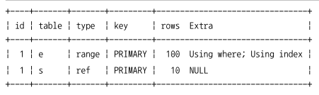
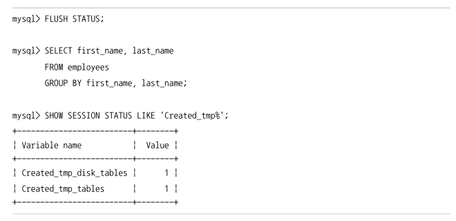

### [9.2.4] GROUP BY 처리

- 쿼리가 스트리밍 처리를 할 수 없게 하는 처리다.
  - 스트리밍 처리: 서버쪽에서 처리할 데이터가 얼마인지에 관계없이 조건에 일치하는 레코드가 검색될 때마다 바로바로 클라이언트로 전송해주는 방식
- `GROUP BY` 절이 있는 쿼리에는 `HAVING` 절을 사용할 수 있다. 이는 `GROUP BY` 결과에 대해 필터링 역할을 수행한다.
- `GROUP BY` 에 사용된 조건은 인덱스를 사용해서 처리 할 수 없으므로 `HAVING` 절을 튜닝하려고 인덱스를 생성하거나 다른 방법을 고민할 필요는 없다.

**인덱스 스캔을 이용하는 GROUP BY(타이트 인덱스 스캔)**

조인의 드라이빙 테이블에 속한 칼럼만 이용해 그루핑할 때 `GROUP BY` 칼럼으로 이미 인덱스가 있다면 그 인덱스를 차례대로 읽으면서 그루핑 작업을 수행하고 그 결과로 조인을 처리한다.

`GROUP BY` 가 인덱스를 사용해서 처리된다 하더라도 그룹 함수(Aggregation function) 등의 그룹값을 처리해야 해서 임시 테이블이 필요할 때도 있다.

**루스 인덱스 스캔을 이용하는 GROUP BY**

루스(Loose) 인덱스 스캔 방식은 인덱스의 레코드를 건너뛰면서 필요한 부분만 읽어서 가져오는 것을 의미한다.

루스 인덱스 스캔을 사용하는 예제:

```sql
EXPLAIN
	SELECT emp_no
	FROM salaries
	WHERE from_date='1985-03-01'
	GROUP BY emp_no;
```

salaries 테이블의 인덱스는 (emp_no, from_date)로 생성되어 있다. 위의 쿼리 문장은 `WHERE` 조건은 인덱스 레인지 스캔 접근 방식을 이용 할 수 없는 쿼리다. 하지만 이 쿼리의 실행 계획은 인덱스 렝니지 스캔을 이용했으며, Extra 칼럼의 메시지를 보면 GROUP BY 처리까지 인덱스를 사용했다.


> 질문: 루스 인덱스 스캔을 설명하는 부분에서 인덱스 레인지 스캔 접근 방식을 사용하는 예시를 가져왔네?

다음은 MySQL 서버가 이 쿼리를 실행한 순서다.

1. (emp_no, from_date) 인덱스를 차례대로 스캔하면서 emp_no의 첫 번째 유일한 값 “10001”을 찾아낸다.
2. (emp_no, from_date) 인덱스에서 emp_no가 “10001” 인 것 중에서 from_date 값이 “1985-03-01” 인 레코드만 가져온다.
3. (emp_no, from_date) 인덱스에서 emp_no의 그다음 유니크한(그룹 키) 값을 가져온다.
4. 3번 단계에서 결과가 더 없으면 처리를 종료하고, 결과가 있다면 2번 과정으로 돌아가서 반복 수행한다.

**MySQL의 루스 인덱스 스캔 방식**

- 단일 테이블에 대해 수행되는 `GROUP BY` 처리에만 사용할 수 있다.
- 프리픽스 인덱스는 루스 인덱스 스캔을 사용할 수 없다.
- 인덱스의 유니크한 값의 수가 적을수록 성능이 향상된다.
- 루스 인덱스 스캔으로 처리되는 쿼리에서는 별도의 임시 테이블이 필요하지 않다.

> MySQL 8.0 버전부터는 루스 인덱스 스캔과 동일한 방식으로 작동하는 인덱스 스킵 스캔(Index Skip Scan) 최적화도 도입됐다. MySQL 8.0 이전 버전까지는 GROUP BY 절의 처리를 위해서만 루스 인덱스 스캔이 사용됐지만 인덱스 스킵 스캔이 도입되면서 옵티마이저가 쿼리에서 필요로 하는 레코드를 검색하는 부분까지 루스 인덱스 스캔 방식으로 최적화가 가능해졌다.

**임시 테이블을 사용하는 GROUP BY**

인덱스를 전혀 사용하지 못할 때 이 방식으로 처리된다.

```sql
EXPLAIN
	SELECT e.last_name, AVG(s.salaty)
	FROM employees e, salaries s
	WHERE s.emp_no=e.emp_no
	GROUP BY e.last_name;
```

MySQL 8.0에서는 `GROUP BY` 가 필요한 경우 내부적으로 `GROUP BY` 절의 칼럼들로 구성된 유니크 인덱스를 가진 임시 테이블을 만들어서 중복 제거와 집합 함수 연산을 수행한다.

위 쿼리를 처리하기 위한 임시 테이블:

```sql
CREATE ETEMPORARY TABLE ... (
	last_name VARCHAR(16),
	salary INT,
	UNIQUE INDEX ux_lastname (last_name)
);
```

그리고 조인의 결과를 한 건씩 가져와 임시 테이블에 중복 체크를 하면서 `INSERT` 또는 `UPDATE` 를 실행한다. 즉 별도의 정렬 작업 없이 `GROUP BY` 가 처리된다.

### 9.2.5 DISTINCT 처리

특정 칼럼의 유니크한 값만 조회하려면 `SELECT` 쿼리에 `DISTINCT` 를 사용한다.

---

**SELECT DISTINCT**

`SELECT` 되는 레코드 중에서 유니크한 레코드만 가져올 때 사용한다.

이 경우에는 `GROUP BY` 와 동일한 방식으로 처리되는데 다음 두 쿼리는 내부적으로 같은 작업을 수행한다.

```sql
SELECT DISTINCT emp_no FROM salaries;
SELECT emp_no FROM salaries GROUP BY emp_no;
```

주의할 점은 `DISTINCT` 는 `SELECT` 하는 레코드(튜플)를 유니크하게 `SELECT` 하는 것이지, 특정 칼럼만 유니크하게 조회하는 것이 아니다. 즉 다음 쿼리에서 `SELECT` 하는 결과는 first_name만 유니크한 것을 가져오는 것이 아니라 (first_name, last_name) 조합 전체가 유니크한 레코드를 가져오는 것이다.

```sql
SELECT DISTINCT frist_name, last_name FROM employees;
-- MySQL 서버는 DISTINCT 뒤의 괄호를 그냥 의미 없이 사용된 괄호로 해석하고 제거해 버린다.
SELECT DISTINCT (frist_name), last_name FROM employees;
-- 두 쿼리는 같다.
```

---

**집합 함수와 함께 사용된 DISTINCT**

`COUNT()` 또는 `MIN()`, `MAX()` 같은 집합 함수 내에서 `DISTINCT` 키워드를 사용할 수 있는데, 이 경우 일반적인 `SELECT DISTINCT` 와 다른 형태로 해석된다.

집합 함수 내에서 사용된 `DISTINCT` 는 그 집합 함수의 인자로 전달된 칼럼값이 유니크한 것들을 가져온다.

```sql
EXPLAIN SELECT COUNT(DISTINCT s.salary)
FROM employees e, salaries s
WHERE e.emp_no=s.emp_no
AND e.emp_no BETWEEN 100001 AND 100100;
```

위 쿼리는 내부적으로 `COUNT(DISTINCT s.salary)` 를 처리하기 위해 임시 테이블을 사용한다.



하지만 이 쿼리의 실행 계획에는 임시 테이블을 사용한다는 메시지는 표시되지 않는다. 이는 버그처럼 보이지만 지금까지 모든 버전의 MySQL 서버에서 보여주는 실행 계획에서 “Using temporary”를 표시하지 않고 있다.

---

### 내부 임시 테이블 활용

MySQL 엔진은 스토리지 엔진으로부터 받아온 레코드를 정렬하거나 그루핑할 때 내부적인 임시 테이블(Internal temporary table)을 사용한다.

이때의 임시 테이블은 `CREATE TEMPORARY TABLE` 명령으로 만든 임시 테이블과는 다르다.

MySQL 엔진이 내부적인 가공을 위해 생성하는 임시 테이블은 다른 세션이나 다른 쿼리에서는 볼 수 없으며 사용하는 것도 불가능하다. 그리고 임시 테이블은 쿼리의 처리가 완료되면 자동으로 삭제된다.

---

**메모리 임시 테이블과 디스크 임시 테이블**

|                        | MySQL 8.0 이전          | MySQL 8.0 이후 |
| ---------------------- | ----------------------- | -------------- |
| 메모리                 | MEMORY 스토리지 엔진    |
| - 가변 길이 타입 지원X | TempTable 스토리지 엔진 |
| 디스크                 | MyISAM 스토리지 엔진    |
| - 트랜잭션 지원 X      | InnoDB 스토리지 엔진    |

MySQL 8.0 버전부터는 `internal_tmp_mem_storage_engine` 시스템 변수를 이용해 메모리용 임시 테이블을 MEMORY와 TempTable 중에 선택할 수 있다. 기본값은 TempTable이다.

TempTable이 최대로 사용 가능한 메모리 크기는 `temptable_max_ram` 시스템 변수로 제어할 수 있다. 기본값은 1GB이다.

임시 테이블의 크기가 1GB 보다 커지는 경우 MySQL 서버는 메모리의 임시 테이블을 두 가지 방식으로 디스크로 저장할지 선택한다.

- MMAP 파일로 디스크에 기록
- InnoDB 테이블로 기록

두 가지 방식 중 선택은 `temptable_use_mmap` 시스템 변수로 설정할 수 있다. 기본값은 ON이다.

---

**임시 테이블이 필요한 쿼리**

다음과 같은 패턴의 쿼리는 MySQL 엔진에서 별도의 데이터 가공 작업을 필요로 하므로 대표적으로 내부 임시 테이블을 생성하는 케이스다.

- `ORDER BY` 와 `GROUP BY` 에 명시된 칼럼이 다른 쿼리
- `ORDER BY` 나 `GROUP BY` 에 명시된 칼럼이 조인의 순서상 첫 번째 테이블이 아닌 쿼리
- `DISTINCT` 와 `ORDER BY` 가 동시에 쿼리에 존재하는 경우 또는 `DISTINCT` 가 인덱스로 처리되지 못하는 쿼리
- `UNION` 이나 `UNION DISTINCT` 가 사용된 쿼리(select_type 칼럼이 `UNION RESULT` 인 경우)
- 쿼리의 실행 계획에서 select_type이 `DERIVED` 인 쿼리

어떤 쿼리의 실행 계획에서 임시 테이블을 사용하는지는 Extra 칼럼에 “Using temporary” 메시지를 확인하면 된다. 하지만 이 메시지가 표시되지 않을 때도 있다. 위의 예에서 마지막 3개의 패턴이 그러한 예다.

---

**임시 테이블이 디스크에 생성되는 경우**

내부 임시 테이블은 기본적으로 메모리상에 만들어지지만 다음과 같은 조건을 만족하면 멤모리 임시 테이블을 사용할 수 없게 된다. 그래서 이 경우에는 디스크 기반의 임시 테이블을 사용한다.

- `UNION` 이나 `UNION ALL` 에서 `SELECT` 되는 칼럼 중에서 길이가 512바이트 이상인 크기의 칼럼이 있는 경우
- `GROUP BY` 나 `DISTINCT` 칼럼에서 512바이트 이상인 크기의 칼럼이 있는 경우
- 메모리 임시 테이블의 크기가 (MEMORY 스토리지 엔진에서) `tmp_table_size` 또는 `max_heap_table_size` 시스템 변수보다 크거나 (TempTable 스토리지 엔진에서) `temptable_max_ram` 시스템 변수 값보다 큰 경우

---

**임시 테이블 관련 상태 변수**

임시 테이블이 디스크에 생성됐는지 메모리에 생성됐는지 확인하려면 MySQL 서버의 상태 변수(SHOW SESSION STATUS LIKE ‘Created_tmp%’;)를 확인해 보면 된다.



FLUSH STATUS: 현재 세션의 상태 값을 초기화

Created_tmp_tables: 쿼리의 처리를 위해 만들어진 내부 임시 테이블의 개수를 누적하는 상태 값

Created_tmp_disk_tables: 디스크에 내부 임시 테이블이 만들어진 개수만 누적해서 가지고 있는 상태 값.

---

## 고급 최적화

MySQL 서버의 옵티마이저가 실행 계획을 수립할 때 통계 정보와 옵티마이저 옵션을 결합해서 최적의 실행 계획을 수립하게 된다.

옵티마이저 옵션은 크게 조인 관련된 옵티마이저 옵션과 옵티마이저 스위치로 구분할 수 있다.

### 옵티마이저 스위치 옵션

옵티마이저 스위치 옵션은 `optimizer_switch` 시스템 변수를 이용해 제어한다.

`optimizer_switch` 시스템 변수에 설정할 수 있는 최적화 옵션:

| 옵티마이저 스위치 이름                  | 기본값 | 설명                                         |
| --------------------------------------- | ------ | -------------------------------------------- |
| batched_key_access                      | off    | BKA 조인 알고리즘의 사용 여부                |
| block_nested_loop                       | on     | Block Nested Loop 조인 알고리즘의 사용 여부  |
| engine_condition_pushdown               | on     | Engine Condition Pushdown 기능 사용 여부     |
| index_condition_pushdown                | on     | Index Condition Pushdown 기능 사용 여부      |
| use_index_extensions                    | on     | Index Extension 최적화 사용 여부             |
| index_merge                             | on     | Index Merge 최적화 사용 여부                 |
| index_merge_intersection                | on     | Index Merge Intersection 최적화 사용 여부    |
| index_merge_sort_union                  | on     | Index Merge Sort Union 최적화 사용 여부      |
| index_merge_union                       | on     | Index Merge Union 최적화 사용 여부           |
| mrr                                     | on     | MRR 최적화 사용 여부                         |
| mrr_cost_bases                          | on     | 비용 기반의 MRR 최적화 사용 여부             |
| semijoin                                | on     | 세미조인 최적화 사용 여부                    |
| firstmatch                              | on     | FirstMatch 세미 조인 최적화 사용 여부        |
| loosescan                               | on     | LosseScan 세미 조인 최적화 사용 여부         |
| materialization                         | on     | Materialization 최적화 사용 여부             |
| (Materialization 세미 조인 최적화 포함) |
| subquery_materialization_cost_bases     | on     | 비용 기반의 Materialization 최적화 사용 여부 |

각각의 옵티마이저 스위치 옵션은 “default”, “on”, “off” 중 하나를 설정한다. 또 옵티마이저 스위치 옵션은 글로벌과 세션별 모두 설정 가능하다.

```sql
// MySQL 서버 전체적으로 옵티마이저 스위치 설정
SET GLOBAL optimizer_switch='index_merge=on,index_merge_union=on,...';
// 현재 커넥션의 옵티마이저 스위치만 설정
SET SESSION optimizer_switch='index_merge=on,index_merge_union=on,...';
```

**MRR과 배치 키 엑세스(mrr & batched_key_access)**

MRR은 Multi-Range Read의 줄임말이다.

MySQL 서버에서 지금까지 지원하던 조인 방식은 드라이빙 테이블의 레코드를 한 건읽어서 드리븐 테이블의 일치하는 레코드를 찾아서 조인을 수행하는 것이다. 이를 네스티드 루프 조인(Nested Loop Join)이라 한다.

MySQL 서버의 내부 구조상 조인 처리는 MySQL 엔진이 처리하지만, 실제 레코드를 검색하고 읽는 부분은 스토리지 엔진이 담당한다. 이때 드라이빙 테이블의 레코드 건별로 드리븐 테이블의 레코드를 찾으면 레코드를 찾고 읽는 스토리지 엔진에서는 아무런 최적화를 수행할 수 없다.

이 같은 단점을 보완하기 위해 MySQL 서버는 조인 대상 테이블 중 하나로 레코드를 읽어서 조인 버퍼에 버퍼링한다. 즉 드라이빙 테이블의 레코드를 읽어서 드리븐 테이블과의 조인을 즉시 실행하지 않고 조인 대상을 버퍼링하는 것이다. 조인 버퍼에 레코드가 가득 차면 비로소 MySQL 엔진은 버퍼링된 레코드를 스토리지 엔진으로 한 번에 요청한다. 이렇게 함으로써 스토리지 엔진은 읽어야 할 레코드들을 데이터 페이지에 정렬된 순서로 접근해서 디스크의 데이터 페이지 읽기를 최소화 할 수 있는 것이다.

이러한 읽기 방식을 MRR이라고 하며, MRR을 응용해서 실행되는 조인 방식을 BKA 조인이라고 한다.

**블록 네스티드 루프 조인(block_nested_loop)**

MySQL 서버에서 사용되는 대부분의 조인은 네스티드 루프 조인(Nested Loop Join)인데, 조인의 연결 조건이 되는 칼럼에 모두 인덱스가 있는 경우 사용되는 조인 방식이다.

네스티드 루프 조인과 블록 네스티드 루프 조인의 가장 큰 차이는

- 조인 버퍼(join_buffer_size 시스템 설정으로 조정되는 조인을 위한 버퍼)가 사용되는지 여부
- 조인에서 드라이빙 테이블과 드리븐 테이블이 어떤 순서로 조인 되는지

이다.

조인 알고리즘에서 “Block”이라는 단어가 사용되면 조인용으로 별도의 버퍼가 사용됐다는 것을 의미한다.

조인은 드라이빙 테이블에서 일치하는 레코드의 건수만큼 드리븐 테이블을 검색하면서 처리된다. 즉 드라이빙 테이블은 한 번에 쭉 읽지만, 드리븐 테이블은 여러 번 읽는다는 것을 의미한다. 그래서 드리븐 테이블을 검색할 때 인덱스를 사용할 수 없는 경우 쿼리는 상당히 느려지며, 옵티마이저는 최대한 드리븐 테이블의 검색이 인덱스를 사용할 수 있게 실행 계획을 수립한다.

어떤 방식으로도 드리븐 테이블의 풀 테이블 스캔이나 인덱스 풀 스캔을 피할 수 없다면 옵티마이저는 드라이빙 테이블에서 읽은 레코드를 메모리에 캐시한 후 드리븐 테이블과 이 메모리 캐시를 조인하는 형태로 처리한다. 이때 사용되는메모리의 캐시를 조인 버퍼(Join buffer)라고 한다. 조인 버퍼는 `join_buffer_size` 라는 시스템 변수로 크기를 제한할 수 있으며, 조인이 완료되면 조인 버퍼는 바로 해제된다**.**

**인덱스 컨디션 푸시다운(index_condition_pushdown)**

MySQL 5.5 버전 까지는 인덱스를 범위 제한 조건으로 사용하지 못하는 경우 MySQL 엔진이 스토리지 엔진으로 전달해주지 않았다. 그래서 스토리지 엔진에서는 불필요한 테이블 읽기를 수행할 수밖에 없었다.

MySQL 5.6 부터는 인덱스를 범위 제한 조건으로 사용하지 못한다고 하더라도 인덱스에 포함된 칼럼의 조건이 있다면 모두 같이 모아서 스토리지 엔진으로 전달한다.

**인덱스 확장(use_index_extensions)**

`use_index_extensions` 옵티마이저 옵션은 InnoDB 스토리지 엔진을 사용하는 테이블에서 세컨더리 인덱스에 자동으로 추가된 프라이머리 키를 활용할 수 있게 할지를 결정하는 옵션이다.

```sql
CREATE TABLE dept_emp (
	emp_no INT NOT NULL,
	dept_no CHAR(4) NOT NULL,
	from_date DATE NOT NULL,
	to_date DATE NOT NULL,
	PRIMARY KEY (dept_no, emp_no),
	KEY ix_fromdate (from_date)
	) ENGINE=innoDB;
```

`dept_emp` 테이블에서 프라이머리 키는 (`dept_no`, `emp_no`)이며, 세컨더리 인덱스 `ix_fromdate` 는 `from_date` 칼럼만 포함한다. 그런데 세컨더리 인덱스는 데이터 레코드를 찾아가기 위해 프라이머리 키인 `dept_no` 와 `emp_no` 칼럼을 순서대로 포함한다. 그래서 최종적으로 `ix_fromdate` 인덱스는 (`from_date` , `dept_no` , `emp_no`) 조합으로 인덱스를 생성한 것과 흡사하게 동작할 수 있게 된다.

**인덱스 머지(index_merge)**

인덱스를 이용해 쿼리를 실행하는 경우, 대부분 옵티마이저는 테이블별로 하나의 인덱스만 사용하도록 실행 계획을 수립한다. 하지만 인덱스 머지 실행 계획을 사용하면 하나의 테이블에 대해 2개 이상의 인덱스를 이용해 쿼리를 처리한다.

머지 실행 계획은 3개의 세부 실행 계획으로 나뉘어 볼 수 있다. 3가지 최적화 모두 여러개의 인덱스를 통해 결과를 가져온다는 것은 동일하지만 각각의 결과를 어떤 방식으로 병합할 지에 따라 구분된다.

- index_merge_intersection
- index_merge_sort_union
- index_merge_union

**인덱스 머지 - 교집합(index_merge_intersection)**

인덱스를 이용하여 테이블을 읽는 경우 대부분은 하나의 인덱스만 활용할 수 있다. 하지만 인덱스 머지 실행계획을 사용하면 하나의 테이블에 대해 2개 이상의 인덱스를 이용하게 된다.

**인덱스 머지 - 합집합(index_merge_union)**

인덱스 머지의 ‘Using union’은 `WHERE` 절에 사용된 2개 이상의 조건이 각각의 인덱스를 사용하되 `OR` 연산자로 연결된 경우에 사용되는 최적화이다.

**인덱스 머지 - 정렬 후 합집합(index_merge_sort_union)**

인덱스 머지 작업을 하는 도중에 결과의 정렬이 필요한 경우 MySQL 서버는 인덱스 머지 최적화의 ‘Sort union’ 알고리즘을 사용한다.

**세미 조인(semijoin)**

다른 테이블과 셀제 조인을 수행하지는 않고, 단지 다른 테이블에서 조건에 일치하는 레코드가 있는지 없는지만 체크하는형태의 쿼리를 세미 조인(Semi-Join)이라고 한다.

MySQL 서버 8.0 버전부터는 세미 조인 쿼리의 성능을 개선하기 위한 최적화 전략이 있다. 이를 세미 조인 최적화라고 부른다.

- Table Pull-out
  - 사용 가능하면 항상 세미 조인보다는 좋은 성능을 내기 때문에 별도로 제어하는 옵션을 제공하지 않는다.
- Duplicate Weed-out
  - marterialization 옵티마이저 스위치로 사용 여부를 선택할 수 있다.
- First Match
  - firstmatch 옵티마이저 옵션으로 사용 여부를 결정할 수 있다.
- Loose Scan
  - loosescan 옵티마이저 옵션으로 사용 여부를 결정할 수 있다.
- Materialization
  - marterialization 옵티마이저 스위치로 사용 여부를 선택할 수 있다.
