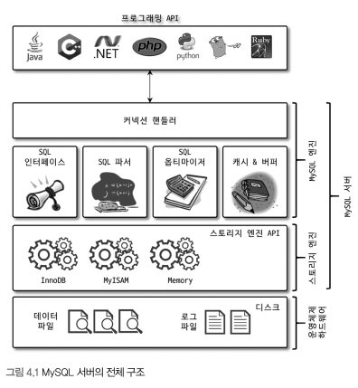
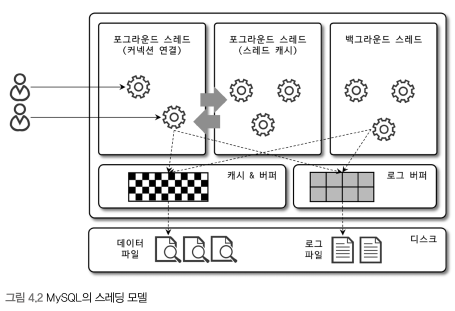

# 아키텍처

## MySQL

- ### 사람의 머리 역할을 담당하는 **MySQL엔진**
- ### 손발 역할을 담당하는 스토리지 **스토리지엔진**

### **MySQL 엔진 아키텍처**

- MySQL 엔진

  - 클라이언트로부터의 접속 및 쿼리 요청을 처리하는 **커넥션 핸들러**
  - SQL 파서 및 전처리기, 쿼리의 최적화된 실행을 위한 **옵티마이저**

- 스토리지 엔진
  - 요청된 SQL 문장을 분석 및 최적화
  - 데이터를 디스크 스토리지에 저장하고 읽기를 담당
  - 스토리지 엔진 다중 사용 가능함
    - 핸들러 API를 만족하는 스토리지 엔진을 추가할 수 있음

> 핸들러 API?
> MySQL 엔진의 쿼리 실행기에서 데이터를 쓰거나 읽어야 할 때는 각 스토리지 엔진에 쓰기 또는 읽기를 요청하는데,
> 이러한 요청을 **핸들러** 요청이라하고, 여기서 사용되는 API를 **핸들러 API**라고 합니다.

### **MySQL 스레딩 구조**

- MySQL 서버는 스레드 기반으로 작동

  - 포그라운드 스레드

    - 사용자가 요청하는 쿼리 문장을 처리함
    - 데이터를 데이터 버퍼나 캐시로부터 가져옴
    - 버퍼나 캐시에 없는 경우 직접 디스크의 데이터나 인덱스 파일로부터 데이터를 읽어와서 작업을 처리함

  - 백그라운드 스레드
    - 로그 스레드
    - 쓰기 스레드
      - 버퍼의 데이터를 디스크로 내려쓰는 작업을 처리함

---

- **MyISAM 테이블**: **포그라운드 스레드**가 디스크 쓰기 작업까지 처리함,

  - 일반적인 쿼리는 쓰기 버퍼링 기능을 사용할 수 없다.
  - 사용자가 INSERT, UPDATE, DELETE 쿼리가 처리될 때까지 기다려야 함

- **innoDB 테이블**: 데이터 버퍼나 캐시까지 처리함, 나머지 버퍼로부터 디스크까지 기록하는 작업은 **백그라운드 스레드**가 처리함
  - 인서트 버퍼(insert Buffer)를 병합하는 스레드
  - 로그를 디스크로 기록하는 스레드
  - innoDB 버퍼 풀의 데이터를 디스크에 기록하는 스레드
  - 데이터를 버퍼로 읽어오는 스레드
  - 잠금이나 데드락을 모니터링하는 스레드

### **메모리 할당 및 사용 구조**

- 글로벌 메모리 영역
  - 클라이언트 스레드 수와 무관하게 하나의 메모리 공간만 할당됨
    - 필요에 따라 2개 이상의 메모리 공간을 할당가능함
  - 모든 스레드에 의해 공유됨
- 로컬 메모리 영역
  - 클라이언트 스레드가 쿼리를 처리하는 데 사용하는 메모리 영역임
  - 각 클라이언트 스레드별로 독립 할당됨(서로 공유X)

### **플러그인 스토리지 엔진 모델**

- 사용자 인증 방식, 검색 엔진, 스토리지 엔진 등을 플러그인 형태로 개발해서 사용 가능
  - 수많은 사용자의 요구 조건을 만족시키기 위함

### **컴포넌트**

- 기존 플로그인 아키텍처를 대체하기 위해 컴포넌트 아키텍처를 지원함
- 플러그인의 단점을 보완해서 구현됨
  - 플로그인의 단점
    - 오직 MySQL 서버와 통신 가능
    - MySQL 서버의 변수나 함수를 직접 호출(캡슐화X)
    - 상호 의존 관계를 설정할 수 없어서 초기화가 어려움

### **쿼리 실행 구조**

_쿼리 파서_

- 사용자 요청을 토큰화하고, 트리 형태의 구조로 만듦
- 쿼리 문장의 기본 문법 오류를 체크함

_전처리기_

- 파서 과정에서 만들어진 트리기반 쿼리 문장에 구조적인 문제점 체크
- 각 토큰의 테이블 이름, 칼럼 이름, 또는 내장 함수와 같으 개체를 매핑함
  - 해당 객체의 존재 여부와 객체의 접근 권한 등을 확인함

_옵티마이저_

- 사용자의 요청으로 들어온 쿼리를 가장 저렴한 비용으로 가장 빠르게 처리할지를 결정하는 역할

_실행 엔진_

- 만들어진 계획대로 각 핸들러에 요청하고 받은 결과를 또 다른 핸들러 요청의 입력으로 연결하는 역할

_핸들러(스토리지 엔진)_

- 실행 엔진의 요청에 따라 데이터를 디스크로 저장하고 읽어오는 역할을 담당함
- 핸들러는 스토리지 엔진을 의미함

### **쿼리 캐시**

- SQL의 실행 결과를 메모리에 캐시함
  - 동일한 SQL 요청에 매루 빠른 성능
  - 하지만 테이블의 데이터 변경 시 캐시에 저장된 데이터 중 관련된 데이터를 전부 삭제해야 함 (성능 저하 유발)
  - MySQL 8.0 이후 삭제된 기능

### **스레드 풀**

- 내부적으로 사용자 요청을 처리하는 스레드 개수를 줄이고, MySQL 서버의 CPU가 제한된 개수의 스레드 처리에만 집중할 수 있게 해서 서버의 자원 소모를 줄이는 것이 목적임

### **트랜잭션 지원 메타데이터**

테이블 구조 정보나 스토어드 프로그램 코드 관전 정보를 InnoDB의 테이블에 저장함
